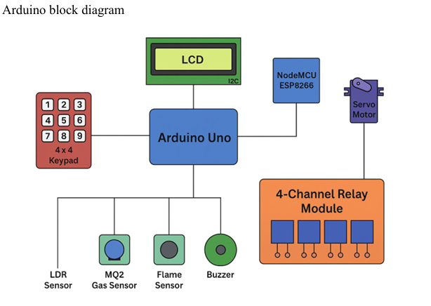

# home-automation-_iot-project
A Smart Home system using Arduino Uno, ESP8266 NodeMCU, and MIT App Inventor for remote monitoring and control.
# IoT Smart Home Automation System

## 📜 Project Description
This project implements a comprehensive Smart Home Automation System designed to monitor environmental conditions and control home appliances remotely. The system ensures home security through password-protected door access and fire/gas detection systems[cite: 13].

## 🚀 Key Features
* **Remote Control:** Control lights, fans, and exhaust systems via a custom Mobile App (MIT App Inventor)[cite: 14].
* **Security:** Password-protected door lock using a keypad and Servo motor[cite: 13].
* **Safety Monitoring:** Real-time detection of Gas (LPG/Smoke) and Fire/Flame with buzzer alerts[cite: 18].
* **Live Monitoring:** View Temperature and Humidity data on the mobile app and local LCD display[cite: 13].

## 🛠️ Hardware Components
* **Microcontroller:** Arduino Uno (ATmega328P) [cite: 18]
* **WiFi Module:** NodeMCU ESP8266 (for IoT connectivity) [cite: 18]
* **Sensors:** * DHT22 (Temperature & Humidity)
    * MQ-2 (Gas/Smoke Sensor)
    * LDR (Light Dependent Resistor)
    * Flame Sensor
* **Actuators:** Servo Motor (Door Lock), DC Motor (Fan), 4-Channel Relay Module [cite: 18]
* **I/O:** 4x4 Keypad, 16x2 LCD Display, Buzzer

## 🔌 Circuit & Block Diagram

## 💻 Tech Stack
* **Firmware:** C++ (Arduino IDE)
* **Mobile App:** MIT App Inventor (Block-based programming)
* **Communication:** Serial Communication (Arduino ↔ NodeMCU) & Wi-Fi (HTTP Requests)

## ⚠️ Challenges & Solutions
During development, we faced issues with Serial Communication voltage mismatch between the Arduino (5V) and NodeMCU (3.3V). This was resolved by using voltage dividers and careful baud rate synchronization (9600 bps)[cite: 445, 471].

## 🔮 Future Improvements
* Integration with Google Assistant/Alexa for voice control[cite: 486].
* Migration to a dedicated cloud platform (Firebase/Blynk) for historical data logging[cite: 482].

## 📄 License
This project is open-source.
